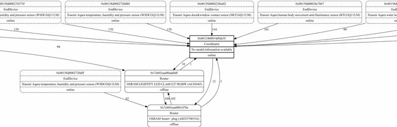

# Zigbee2Mqtt Binding

This binding connects openHAB with your Zigbee2Mqtt server using MQTT.

# Table of contents

1. [Disclaimer](https://github.com/nibi79/zigbee2mqtt/tree/master#disclaimer)
2. [Prerequisites](https://github.com/nibi79/zigbee2mqtt/tree/master#installation-and-upgrade)
3. [Installation and upgrade](https://github.com/nibi79/zigbee2mqtt/tree/master#installation-and-upgrade)
3. [Supported Things](https://github.com/nibi79/zigbee2mqtt/tree/master#supported-things)
4. [Discovery](https://github.com/nibi79/zigbee2mqtt/tree/master#discovery)
5. [Configuration](https://github.com/nibi79/zigbee2mqtt/tree/master#configuration)
6. [Channels](https://github.com/nibi79/zigbee2mqtt/tree/master#channels)
7. [File based configuration](https://github.com/nibi79/zigbee2mqtt/tree/master#file-based-configuration)
8. [Support](https://github.com/nibi79/zigbee2mqtt/tree/master#support)

***

## Disclaimer

This binding is currently under development. Your help and testing would be greatly appreciated but there is no stability or functionality warranty.

## Prerequisites

- A working Zigbee2Mqtt installation (https://github.com/Koenkk/zigbee2mqtt)
- Enable 'homeassistant' in data/configuration.yaml (http://www.zigbee2mqtt.io/configuration/configuration.html)

## Installation and upgrade

For an installation the [latest release](https://github.com/nibi79/zigbee2mqtt/releases) should be copied into the /addons folder of your openHAB installation.
For an upgrade the existing file should be overwritten. On major or structural changes existing things might have to be deleted and recreated, existing channels might be kept. For further information please read release notes of a corresponding release.

## Supported Things

Currently following Things are supported:

- **Zigbee2Mqtt Server** Thing representing the Zigbee2Mqtt server
- One or many Things for supported **Zigbee2Mqtt Device**

## Discovery

After configuring the **Zigbee2Mqtt Server**, automatic discovery for **Zigbee2Mqtt Device** will start. If successful, your **Zigbee2Mqtt Device** will be found and can be added without further configuration. 

If new devices joined to the network ([documentation](http://www.zigbee2mqtt.io/getting_started/pairing_devices.html)) they will automatically appear in the INBOX.

## Binding Configuration

Following options can be set for the **Zigbee2Mqtt Server**:

| Property   | Description |
|-----------|-----------|
| mqttbrokerIpAddress | IP-Address  or hostname of the MQTT-Broker|
| mqttbrokerPort | Port of the MQTT-Broker |
| mqttbrokerUsername | Username to access the MQTT-Broker |
| mqttbrokerPassword | Password to access the MQTT-Broker. |
| z2mBaseTopic | Base topic for Zigbee2Mqtt MQTT messages: default = 'zigbee2mqtt'. Can be edit in data/configuration.yaml -> `base_topic` |
| z2mDiscoveryTopic | Discovery topic which is used by Zigbee2Mqtt: default = 'homeassistant'. Can be edit in data/configuration.yaml -> `homeassistant_discovery_topic`|

## Channels

### Currently following **Channels** are supported on the **Zigbee2Mqtt Server**:

| Channel   | Type | Values |
|-----------|-----------|-----------|
| permitJoin| `Switch` | ON/OFF |
| logLevel  | `String` | DEBUG, INFO, WARN, ERROR |
| networkMap| `Image` |  |

Example NetworkMap: 




### Currently following **Channels** are supported on the **Zigbee2Mqtt Device**:

| Channel   | Type | Values |
|------------|-----------|-----------|
| state      | `Switch` | ON/OFF |
| temperature| `Number` | |
| illuminance| `Number` | |
| occupancy  | `Switch` | ON/OFF |
| humidity   | `Number` | |
| pressure   | `Number` | |
| contact    | `Contact` | OPEN/CLOSE |
| water_leak | `Switch` | ON/OFF |
| battery    | `Number` | |
| linkquality| `Number` | |
| brightness | `Number` | |
| color_temp | `Number` | |
| color      | `Color`  | |
| click      | `String` | This is a trigger channel and cannot be link to an item. The values depend on device e.g.: single, double, triple, quadruple ... |
| action     | `String` | This is a trigger channel and cannot be link to an item. The values depend on device e.g.: shake, wakeup, fall, tap, slide, flip180 ... |

## File based configuration

### .things
```
Bridge zigbee2mqtt:zigbee2mqttServer:z2m [ 
    mqttbrokerIpAddress="localhost", 
    mqttbrokerPort=1883, 
    mqttbrokerUsername="openhabian", 
    mqttbrokerPassword="*****",
    z2mBaseTopic="zigbee2mqtt", 
    z2mDiscoveryTopic="homeassistant" ] {
    
   Thing zigbee2mqttDevice XiaomiMCCGQ11LM "Xiaomi MCCGQ11LM door" @ "Zigbee2Mqtt" [ieeeAddr="0x00158d0002286a02"]
   Thing zigbee2mqttDevice XiaomiWSDCGQ11LM "Xiaomi WSDCGQ11LM temperature" @ "Zigbee2Mqtt" [ieeeAddr="0x00158d0002320b4f"]
   Thing zigbee2mqttDevice XiaomiMFKZQ01LM "Xiaomi MFKZQ01LM cube" @ "Zigbee2Mqtt" [ieeeAddr="0x00158d000276f951"]
   Thing zigbee2mqttDevice OsramAC03645 "Osram AC03645 bulb" @ "Zigbee2Mqtt" [ieeeAddr="0x7cb03eaa00ada0df"]
}
```

### .items
```
// Zigbee2Mqtt Server
Group gZ2m
String Z2mLogLevel "LogLevel" (gZ2m) {channel="zigbee2mqtt:zigbee2mqttServer:z2m:logLevel"}
Switch Z2mPermitJoin "PermitJoin" (gZ2m) {channel="zigbee2mqtt:zigbee2mqttServer:z2m:permitJoin"}
Image Z2mNetworkMap "NetworkMap" (gZ2m) {channel="zigbee2mqtt:zigbee2mqttServer:z2m:networkMap"}

// Xiaomi Sensor (WSDCGQ11LM)
Group gXiaomiWSDCGQ11LM
Number XiaomiWSDCGQ11LMTemperature "Temperatur OD [%.1f °C]" <temperature> (gXiaomiWSDCGQ11LM) { channel="zigbee2mqtt:zigbee2mqttDevice:z2m:XiaomiWSDCGQ11LM:temperature"}
Number XiaomiWSDCGQ11LMHumidity "Humidity [%d %%]" <humidity> (gXiaomiWSDCGQ11LM) { channel="zigbee2mqtt:zigbee2mqttDevice:z2m:XiaomiWSDCGQ11LM:hunidity"}
Number XiaomiWSDCGQ11LMPressure "Pressure [%d mbar]" <pressure> (gXiaomiWSDCGQ11LM) { channel="zigbee2mqtt:zigbee2mqttDevice:z2m:XiaomiWSDCGQ11LM:pressure"}
Number XiaomiWSDCGQ11LMLinkquality "Linquality [%d]" <signal> (gXiaomiWSDCGQ11LM) { channel="zigbee2mqtt:zigbee2mqttDevice:z2m:XiaomiWSDCGQ11LM:linkquality"}
Number XiaomiWSDCGQ11LMBattery "Battery [%.1f %%]" <batterylevel> (gXiaomiWSDCGQ11LM) { channel="zigbee2mqtt:zigbee2mqttDevice:z2m:XiaomiWSDCGQ11LM:battery"}

// Xiaomi Door (MCCGQ11LM)
Group gXiaomiMCCGQ11LM
Contact XiaomiMCCGQ11LMContact "Door [%s]" <door> (gXiaomiMCCGQ11LM) {channel="zigbee2mqtt:zigbee2mqttDevice:z2m:XiaomiMCCGQ11LM:contact"}
Number XiaomiMCCGQ11LMLinkquality "Linquality [%d]" <signal> (gXiaomiMCCGQ11LM) {channel="zigbee2mqtt:zigbee2mqttDevice:z2m:XiaomiMCCGQ11LM:linkquality"}
Number XiaomiMCCGQ11LMBattery  "Battery [%.1f %%]" <batterylevel> (gXiaomiMCCGQ11LM) {channel="zigbee2mqtt:zigbee2mqttDevice:z2m:XiaomiMCCGQ11LM:battery"}

// Xiaomi Cube (MFKZQ01LM)
Group gXiaomiMFKZQ01LM
Number XiaomiMFKZQ01LMLinkquality "Linquality [%d]" <signal> (gXiaomiMFKZQ01LM) {channel="zigbee2mqtt:zigbee2mqttDevice:z2m:XiaomiMFKZQ01LM:linkquality"}
Number XiaomiMFKZQ01LMBattery "Battery [%.1f %%]" <batterylevel> (gXiaomiMFKZQ01LM) { channel="zigbee2mqtt:zigbee2mqttDevice:z2m:XiaomiMFKZQ01LM:battery"}

//Osram Bulb (AC03645)
Group gOsramAC03645
Switch OsramAC03645Power "Power" <light> (gOsramAC03645) { channel="zigbee2mqtt:zigbee2mqttDevice:z2m:OsramAC03645:state"}
Dimmer OsramAC03645Brightness "Brightness [%d]" (gOsramAC03645) { channel="zigbee2mqtt:zigbee2mqttDevice:z2m:OsramAC03645:brightness"}
Dimmer OsramAC03645Colortemp "Colortemp" (gOsramAC03645) { channel="zigbee2mqtt:zigbee2mqttDevice:z2m:OsramAC03645:color_temp"}
Color OsramAC03645RGBW "Color" (gOsramAC03645) { channel="zigbee2mqtt:zigbee2mqttDevice:z2m:OsramAC03645:color"}
Number OsramAC03645Linkquality "Linquality [%d]" <signal> (gOsramAC03645) {channel="zigbee2mqtt:zigbee2mqttDevice:z2m:OsramAC03645:linkquality"}
```

### .sitemap
```
sitemap zigbee2mqtt label="Zigbee2Mqtt"
{ 
    Frame label="Zigbee2Mqtt Server"{
        Selection item=Z2mLogLevel  mappings=[debug="Debug", info="Info", warn="Warn", error="Error"]
        Switch item=Z2mPermitJoin
        Image item=Z2mNetworkMap
    }

    Frame label="XiaomiWSDCGQ11LM SENSOR"{
        Text item=XiaomiWSDCGQ11LMTemperature 
        Text item=XiaomiWSDCGQ11LMHumidity
        Text item=XiaomiWSDCGQ11LMPressure
        Text item=XiaomiWSDCGQ11LMLinkquality
        Text item=XiaomiWSDCGQ11LMBattery
    }

    Frame label="XiaomiMCCGQ11LM DOOR"{
        Switch item=XiaomiMCCGQ11LMContact
        Text item=XiaomiMCCGQ11LMLinkquality
        Text item=XiaomiMCCGQ11LMBattery     
    }


    Frame label="XiaomiMFKZQ01LM CUBE"{
        Text item=XiaomiMFKZQ01LMLinkquality
        Text item=XiaomiMFKZQ01LMBattery     
    }

    Frame label="OsramAC03645 BULB"{
        Switch item=OsramAC03645Power 
        Slider item=OsramAC03645Brightness
        Slider item=OsramAC03645Colortemp
        Colorpicker item=OsramAC03645RGBW
        Text item=OsramAC03645Linkquality
    }
} 
```

### .rules
```
 rule "Zigbee2Mqtt Cube SLIDE"
 when
   Channel "zigbee2mqtt:zigbee2mqttDevice:z2m:XiaomiMFKZQ01LM:action" triggered "slide"
 then
   logInfo("cube", "slided" )

 end
```
or
```
rule "Zigbee2Mqtt Cube action"
when
    Channel "zigbee2mqtt:zigbee2mqttDevice:z2m:XiaomiMFKZQ01LM:action" triggered
then
    switch(receivedEvent.getEvent()) {
        case "slide": {
             logInfo("cube", "cube slided" )
        }
       case "rotate_right": {
             logInfo("cube", "cube rotate_right" )
        }        
       case "rotate_left": {
             logInfo("cube", "cube rotate_left" )
        }          
       case "shake": {
             logInfo("cube", "cube shake" )
        }
       case "fall": {
             logInfo("cube", "cube fall" )
        }          
    }
end
```

## Support

If you encounter critical issues with this binding, please consider to:

- create an [issue](https://github.com/nibi79/zigbee2mqtt/issues) on GitHub
- search [community forum](https://community.openhab.org/) for answers already given
- or make a new post there, if nothing was found

In any case please provide some information about your problem:

- openHAB and binding version 
- error description and steps to retrace if applicable
- any related `[WARN]`/`[ERROR]` from openhab.log (`log:set DEBUG org.openhab.binding.zigbee2mqtt`)
- whether it's the binding, bridge, device or channel related issue

For the sake of documentation please use English language. 

